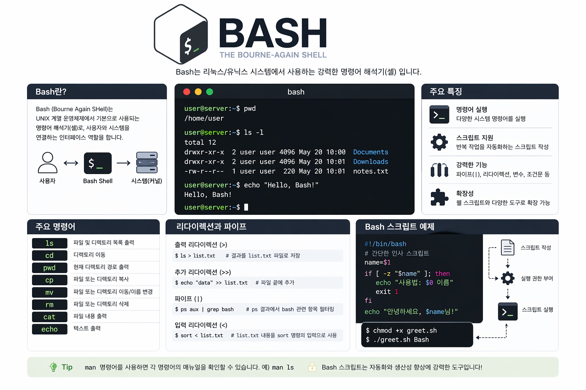

# Bash Repository

🔗 Blog: [Bash 자료](https://lucky-gun.com/tag/bash/)

이 저장소는 Bash 학습, 실습, 그리고 실제 운영 환경 구성을 기록한 공간입니다.

## 📂 Repository Structure

### 🧪 Kakaocloud (실습 & 실험)
| 디렉토리 | 설명 |
|----------|------|
| Kakaocloud | 직장 기간 동안 쉽게 업무보기 위해 만든 Bash 쉘 스크립트 (간단한 프로그램) |

---
